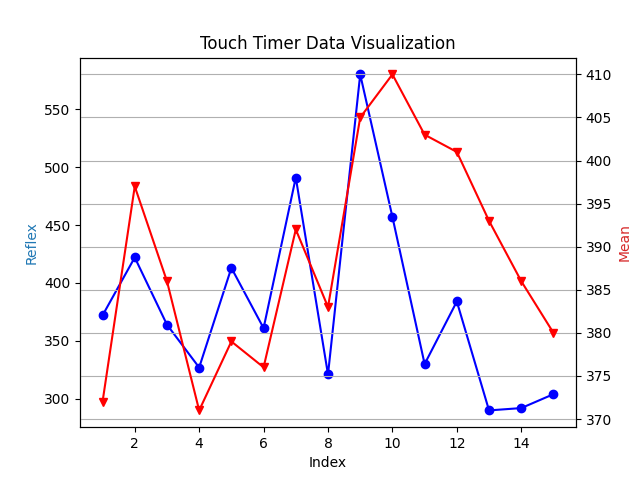

# IoT Reflex Analytics

An End-to-End project that bridges **Embedded Systems (Arduino)** for data acquisition and **Python (Data Science)** for statistical analysis.

This project goes beyond a simple game; it is a study on human consistency, the **"Foreperiod Effect"** (how waiting time affects reaction speed), and statistical convergence, visualized through a dual-axis chart.



*(Figure 1: The dual-axis graph showing the Raw Reflex Data vs. the Running Mean convergence)*

## Project Overview
The goal is to measure human reaction time with millisecond precision and analyze the stability of the "Mean" (Average) over a set of 15 samples using the **Law of Large Numbers**.

The system consists of two main parts:
1.  **Hardware (The Edge):** An Arduino-based device that generates random stimuli (LED) and captures user input (Button) using a non-blocking State Machine architecture.
2.  **Software (The Analysis):** A Python pipeline that processes the raw time-series data to visualize how the average stabilizes as more data is collected.

## Circuit Diagram
Here is the wiring connection for the Arduino, OLED, and buttons used in this project:


*(Figure 2: Wokwi Wiring Diagram - OLED I2C connected to A4/A5, Button to Pin 2, LED to Pin 13)*

## Key Features
* **Randomized Foreperiod:** The system waits between 2000-5000ms randomly before the LED turns on to prevent prediction and test true reflex.
* **Real-time Edge Computing:** The Arduino calculates the running average on-the-fly before sending formatted data to the Serial Monitor.
* **Statistical Visualization:** A Python script generates a professional dual-axis chart comparing Raw Reflex Time (Volatility) vs Running Mean (Convergence).

## Hardware & Tech Stack
* **Microcontroller:** Arduino Uno (Simulated on Wokwi)
* **Display:** SSD1306 OLED (I2C)
* **Logic:** Finite State Machine (FSM), Non-blocking `millis()` timers.
* **Data Science:** Python 3.x, `Pandas` (Processing), `Matplotlib` (Visualization).

## Data Analysis Insight
Based on the collected dataset (as seen in the visualization):
* **The Outlier Incident (Index 9):** A significant spike occurs at Index 9 (approx. 580ms). This demonstrates the **Foreperiod Effect**, where a longer-than-usual waiting time caused a lapse in focus ("vigilance decrement").
* **Statistical Inertia (Mean Drag):** The red line (Mean) rises sharply after Index 9. Even though the subsequent reflexes (Index 13-15) were excellent (~300ms), the Mean recovers slowly, visualising the sensitivity of the Mean metric to outliers.
* **Performance Consistency:** Excluding the outlier, the raw data (Blue Line) tends to stabilize in the 300ms - 400ms range, indicating the subject's baseline reaction time.

## How to Run
### 1. The Hardware Simulation
1.  Open the project files in [Wokwi](https://wokwi.com).
2.  Start the simulation.
3.  Wait for the Yellow LED to turn ON, then press the button immediately.
4.  Repeat for 15 rounds until "GAME OVER" appears on the OLED.
5.  Copy the output from the **Serial Monitor**.

### 2. The Data Analysis
1.  Paste the serial output into a file named `data.csv` in the project folder.
2.  Run the Python script:
    ```bash
    pip install pandas matplotlib
    python analysis.py
    ```
3.  The visualization graph will appear.

## File Structure
* `sketch.ino`: Main Arduino Firmware (C++) containing FSM Logic.
* `libraries.txt`: Required Arduino Libraries (Adafruit GFX/SSD1306).
* `diagram.json`: Wokwi Circuit Configuration.
* `analysis.py`: Python Script for Data Visualization.
* `data.csv`: Sample Dataset captured from Serial Monitor.

---
*Created by Zaka Ahmad Ghofari as part of an IoT & Data Science learning journey.*
